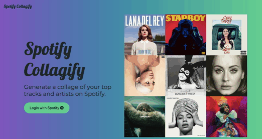
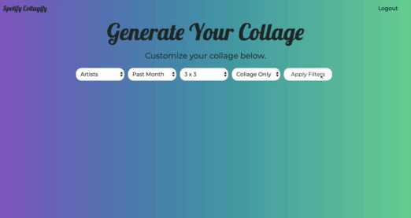

# Spotify Collagify

Spotify Collagify is a web application that allows users to generate a collage based on their
listening history.

This was built with Python and Flask on the backend and HTML, CSS and Javascript/jQuery/AJAX
on the frontend.

## Demo
Homepage/Login

User Page and Collage Creation

## Features
Upon successful login, users are able to make a custom collage.
A user can choose to display either artists or tracks.
Next, users are able to choose display their results from three time ranges: the past month, last 6 months, or overall.
Then, the user must specify the size of the collage. 3x3 is the default, and 4x4 is another option.
Lastly, the user can choose the style of the collage. Options include:
"collage only", which will only display the collage.
"with list", which will display the collage along with a list of their top artists/tracks.
"with text", which will display the collage with the names of the top artists/tracks on the collage itself.

In order to start over, the user can simply refresh the page.

### Thank You To:
<ul>
<li>Chrome's Dev Tools</li>
<li>Stack Overflow</li>
<li>Pesticide Chrome Extension</li>
<li>Cssgradient.io, where I got my cool gradient background.</li>
</ul>
